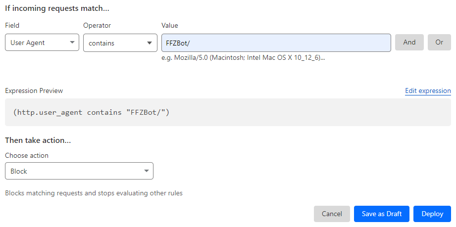

# Meet Our Robot

The FrankerFaceZ Link Preview service makes use of two separate bots that
work together to serve up hot, fresh previews for our users. Each bot can
be identified by its [User-Agent](https://en.wikipedia.org/wiki/User-Agent_header).

## 1. FFZBot
`Mozilla/5.0 (compatible; FFZBot/5.0.0; +https://www.frankerfacez.com)`

This is the big one. FFZBot is an open-source robot that accepts URLs,
visits them, and does its best to extract a useful summary to show our
users. Sometimes, it'll use a website's API. Other times, it'll rely on
scraping tags, like [`<meta>` tags](https://en.wikipedia.org/wiki/Meta_element),
from the page.

Not only that, but FFZBot is a smart cookie. It has cookie support, it'll
follow redirects, and it obeys `Strict-Transport-Security` headers. The bot
will **not** execute JavaScript, however, and it does not attempt to solve
CAPTCHAs or bypass other restrictions.

FFZBot runs as a Cloudflare Worker, and responses are cached for around
thirty minutes. You might see multiple requests from FFZBot despite the
caching. This is due to the distributed nature of Cloudflare Workers. If
multiple users in different regions request information about the link at
the same time, it'll be handled by separate instances of the bot running
in each region.

In addition to making requests for page content, FFZBot performs safety checks
on the URLs it visits and it returns that safety information to clients.
These safety checks include:

1. Checking each URL against the [Google Safe Browsing](https://safebrowsing.google.com/) list of problematic URLs.
2. ~~Checking each domain against [Cloudflare DNS for Families](https://developers.cloudflare.com/1.1.1.1/setup/#1111-for-families) (in malware mode, specifically).~~ (Note: This is currently disabled due to performance concerns with the Worker.)
3. Checking each URL chain to see if `grabify.link` is involved, as Grabify is
a URL shortener designed specifically for logging IP addresses and other personal
information from users who click the link.


### Identifying Traffic

Traffic from FFZBot can be identified through its `User-Agent`. All requests
from FFZBot (as well as ImageGrabber) will have the string `FFZBot/` in the
`User-Agent` string.

FFZBot runs as a Cloudflare Worker, and as such traffic from FFZBot should
be expected to come from Cloudflare's IP ranges. You can find those at:
https://www.cloudflare.com/ips/

Cloudflare adds a `CF-Worker` header to all requests made from Workers, and
you can use this to verify the host that started the request. FFZBot's
requests should have a header like this:

```http
CF-Worker: frankerfacez.com
```

:::warning
This is an implementation detail on Cloudflare's behalf, and outside of our
control. As such, it may change in the future.
:::

For more details on headers that Cloudflare may include on FFZBot's requests,
[see their documentation](https://developers.cloudflare.com/fundamentals/reference/http-request-headers/).


### Open-Source

FFZBot is open-source, so you can help develop it or use it for your own
projects. There are two relevant projects:

1. [Link-Service](https://github.com/FrankerFaceZ/Link-Service)

    Link-Service is a node library that handles the core logic of the link
    preview system. This includes all the special website handlers, the
    meta-based fallback handler, the URL safety checks, and everything else.

    <LinkPreview
        :forceShort="true"
        :link="true"
        href="https://github.com/FrankerFaceZ/Link-Service"
    />

2. [Link-Worker](https://github.com/FrankerFaceZ/Link-Worker)

    Link-Worker is a Cloudflare Worker that wraps the `Link-Service` library
    so that it can serve requests. It's a very simple project. Unless you
    plan on running your own Worker, you probably don't need this.

    <LinkPreview
        :forceShort="true"
        :link="true"
        href="https://github.com/FrankerFaceZ/Link-Worker"
    />
    


## 2. ImageGrabber
`Mozilla/5.0 (compatible; FFZBot/ImageGrabber; +https://www.frankerfacez.com)`

This is the little one. ImageGrabber is responsible for fetching images
and other rich content. It acts as a proxy, preventing FrankerFaceZ clients
from needing to make requests back to third-party servers.

This is done for security reasons. Because requests go through our servers,
bad actors can't use request logging to gain access to users' IP addresses
or other information.

:::tip
Note that ImageGrabber is not used for *all* media. In the case of trusted
third-parties, clients will make direct requests. This is done for large,
well-known services like YouTube.
:::

ImageGrabber is currently based on the [imageproxy](https://github.com/willnorris/imageproxy) open-source project.

<LinkPreview
    :forceShort="true"
    :link="true"
    href="https://github.com/willnorris/imageproxy"
/>


### Identifying Traffic

ImageGrabber, unlike the rest of FFZBot, is not currently hosted on Cloudflare.
However, like FFZBot it can be identified through its `User-Agent`. All requests
from ImageGrabber will have the string `FFZBot/` in the `User-Agent` string.

You can obtain a list of IP addresses that ImageGrabber traffic will originate
from at this URL:

https://link-service.workers.frankerfacez.com/ips


## Regarding `robots.txt`

FFZBot **does not** respect the contents of [`robots.txt`](https://en.wikipedia.org/wiki/Robots.txt)
routes. We are not alone in doing so. [Slackbot](https://api.slack.com/robots)
and DiscordBot behave the same way. You might be wondering why?

Slack's own page describes the problem well. If we did honor `robots.txt`,
it would create problems for our own users as too many websites go out
of their way to block all robots. FFZBot is not a crawler. It doesn't follow
links. It acts on behalf of a human.


## I Want Off Mx. FFZBot's Wild Ride

Don't want FFZBot accessing your website? It's fine, we understand. The
easiest way to accomplish that is by blocking traffic from FFZBot's
[User-Agent](https://en.wikipedia.org/wiki/User-Agent_header). All you
need to do is check for a `User-Agent` containing the characters
`FFZBot/`. That'll take care of both bots. Below are instructions on
how to do that for two popular environments.

Not good enough? Please [contact us](https://www.frankerfacez.com/contact) and
we'll work something out.


### Cloudflare

You can block requests based on `User-Agent` using Cloudflare's Web Application
Firewall (WAF) custom rules. That's under Security > WAF on their dashboard.

You'll want to make a custom rule, with the Field set to `User-Agent`, the
Operator set to `contains`, and the Value set to `FFZBot/`. Then, set the Action
at the bottom to `Block`. It should look something like this:



Just deploy your rule, and we're gone.

### nginx

To block requests in nginx based on a `User-Agent`, you'll need to add an
[if directive](https://nginx.org/en/docs/http/ngx_http_rewrite_module.html#if)
to your configuration. This relies on the `ngx_http_rewrite_module`, so make
sure your build of nginx has access to that and that it's loaded.

Open your relevant nginx configuration file, and add the following directive
within the relevant block. Depending on how thorough you want to be, this
could be within a `server` block or a `location` block:

```nginx
http {
    # ... other http-block directives ...

    server {
        # ... other server-block directives ...

        location / {
            # ... other location-block directives ...

            if ($http_user_agent ~ (FFZBot) ) { // [!code focus:3]
                return 403;
            }

            # ... other location-block directives ...
        }
    }
}
```

This performs a case-sensitive search against the regular expression `(FFZBot)`,
and if it matches, it returns a `403 Forbidden` response immediately. Reload
nginx, and we're gone.

:::tip
Please note that this is a basic example, and you'd likely be better served
searching for a more comprehensive guide to blocking bots via nginx configuration.
The config files can be very complex.
:::